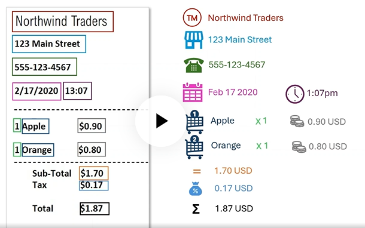
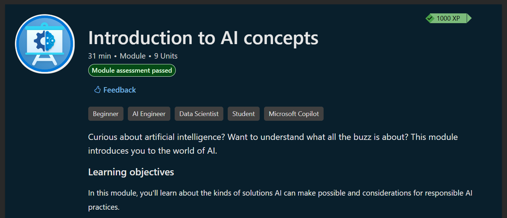
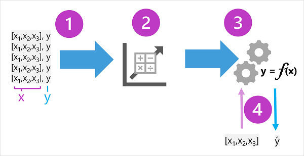

Completando el training course de Azure (AI-900). Voy a ir bajando notas y recursos en este repo.

### Unidad 01

Los primeros temas que se ven son muy generales:

- AI generativa: vemos cómo funcionan los LLM para devolver un resultado a partir de un prompt.
- Computer vision: entrenamiento  de modelos de clasificación de imágenes, detección de objetos.
- Speech recognition: escuchar e interpretar el discurso. Usamos la capacidad del speech-to-text. Speech synthesis es la capacidad de hablar (text-to-speech).
- NLP: más simple que un LLM, más específico (ejemplo clasificar texto, detectar el idioma, análisis de sentimiento, etc.)
- Extraer data e insights: basado en OCR (optical character recognition) buscamos algo específico en un documento.

Ejemplo de extracción de información:

### Responsible AI

Se incluye un módulo sobre ética.

En un ejemplo se comenta cómo el modelo está forzado a responder dentro de los marcos legales:

Estos modelos tienen **filtros de contenido**.

Algunos principios que setearon en Microsoft para sus m

- **Fairness**: La data con la que se entrenan los modelos. Los desarrolladores tienen que minimizar los sesgos que pueda tener el modelo basado en la data de entrenamiento.
- **Reliability and safety**: La IA está basada en probabilística, no es infalible. Debemos considerar esto al desarrollar aplicación mitigando este riesgo.
- **Privacy and security**: Mantener la información segura.
- **Inclusiveness**: Pensar soluciones inclusivas que no dejen usuarios afuera.
- **Transparency**: ser realistas y hacer que el usuario sea conciente sobre cómo funciona el sistema y sus posibles limitaciones (evitar que parezca "magia").
- Accountability: las personas y organizaciones que desarrollan soluciones con IA son responsables de sus acciones. 

Módulo completado el viernes 27/06/25

---
### Unidad 02

Introducción a machine learning

"Machine learning is in many ways the intersection of two disciplines - data science and software engineering. The goal of machine learning is to use data to create a predictive model that can be incorporated into a software application or service. To achieve this goal requires collaboration between data scientists who explore and prepare the data before using it to _train_ a machine learning model, and software developers who integrate the models into applications where they're used to predict new data values (a process known as _inferencing_)."

## Machine learning as a _function_

Because machine learning is based on mathematics and statistics, it's common to think about machine learning models in mathematical terms. Fundamentally, a machine learning model is a software application that encapsulates a _function_ to calculate an output value based on one or more input values. The process of defining that function is known as _training_. After the function has been defined, you can use it to predict new values in a process called _inferencing_.

- In the ice cream sales scenario, our goal is to train a model that can predict the number of ice cream sales based on the weather. The weather measurements for the day (temperature, rainfall, windspeed, and so on) would be the _features_ (_**x**_), and the number of ice creams sold on each day would be the _label_ (_**y**_).
